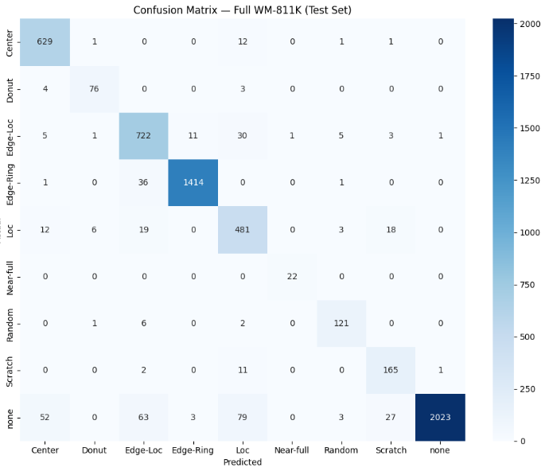
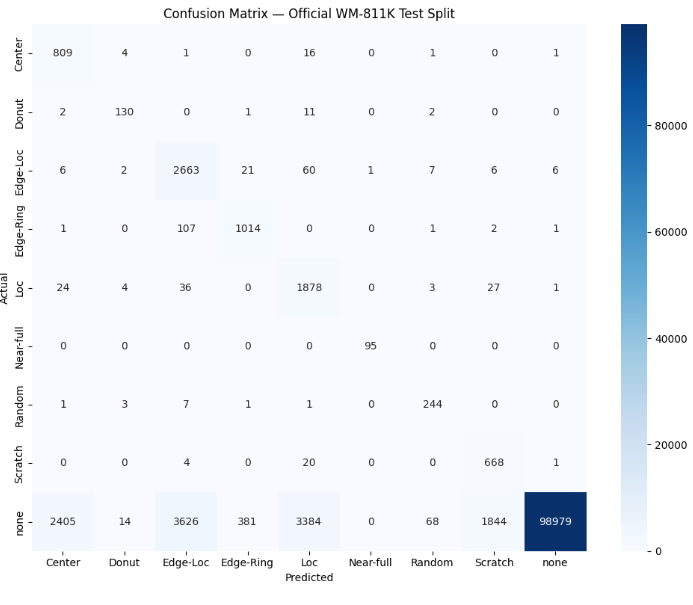
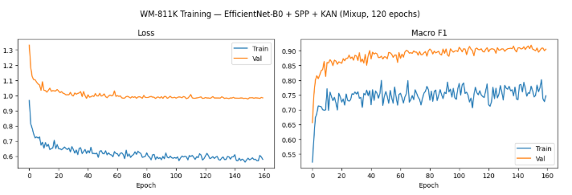
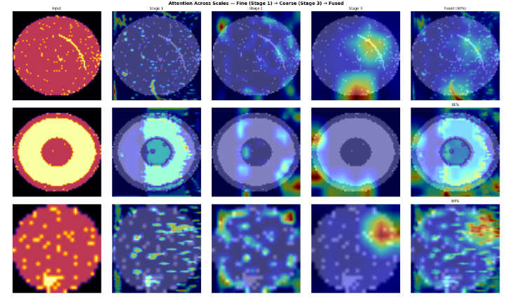
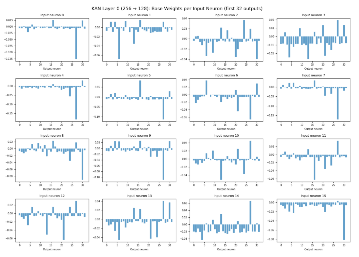
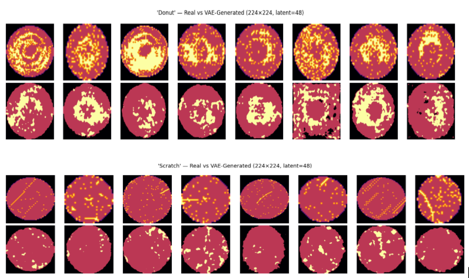

# Wafer Defect Classification with Multiscale Features + Efficient-KAN

A novel approach to semiconductor wafer map defect classification on the WM-811K dataset, combining **multiscale feature extraction** via EfficientNet-B0 with **Spatial Pyramid Pooling (SPP)** and a **Kolmogorov-Arnold Network (KAN)** classifier. This architecture replaces the traditional MLP classification head with Efficient-KAN's learnable B-spline activation functions, enabling nonlinear decision boundaries with intrinsic interpretability — a critical property for root cause analysis in semiconductor manufacturing.


---

## Key Results

### Balanced Evaluation (Stratified 70/15/15 Split, All 9 Classes)

| Metric | Value |
|--------|-------|
| **Overall Accuracy** | 93.0% |
| **Macro F1** | 0.913 |
| **Macro Recall** | 0.937 |
| **Defect Detection Accuracy** | 94.8% |
| **Clean Wafer Accuracy** | 89.9% |
| **Local Defect Accuracy** (Center, Loc, Edge-Loc) | 93.4% |
| **Global Defect Accuracy** (Edge-Ring, Near-full, Random, Scratch) | 96.6% |

| Class | Precision | Recall | F1-Score | Support |
|-------|-----------|--------|----------|---------|
| Center | 0.895 | 0.977 | 0.934 | 644 |
| Donut | 0.894 | 0.916 | 0.905 | 83 |
| Edge-Loc | 0.851 | 0.927 | 0.888 | 779 |
| Edge-Ring | 0.990 | 0.974 | 0.982 | 1452 |
| Loc | 0.778 | 0.892 | 0.831 | 539 |
| Near-full | 0.957 | 1.000 | 0.978 | 22 |
| Random | 0.903 | 0.931 | 0.917 | 130 |
| Scratch | 0.771 | 0.922 | 0.840 | 179 |
| None | 0.999 | 0.899 | 0.946 | 2250 |

<!-- INSERT IMAGE: Confusion Matrix — Full WM-811K (Test Set) -->


### Official WM-811K Test Split (118,595 Samples, 93.3% None)

For direct comparability with published methods, we also evaluate on the dataset's built-in `trainTestLabel` split, which reflects the natural production distribution where clean wafers dominate at 93.3%.

| Metric | Value |
|--------|-------|
| **Overall Accuracy** | 89.8% |
| **Macro F1** | 0.703 |
| **Macro Recall** | 0.943 |
| **Defect Detection Accuracy** | 95.0% |
| **Clean Wafer Accuracy** | 89.4% |
| **Local Defect Accuracy** (Center, Loc, Edge-Loc) | 95.9% |
| **Global Defect Accuracy** (Edge-Ring, Near-full, Random, Scratch) | 93.1% |

| Class | Precision | Recall | F1-Score | Support |
|-------|-----------|--------|----------|---------|
| Center | 0.249 | 0.972 | 0.397 | 832 |
| Donut | 0.828 | 0.890 | 0.858 | 146 |
| Edge-Loc | 0.413 | 0.961 | 0.578 | 2772 |
| Edge-Ring | 0.715 | 0.901 | 0.797 | 1126 |
| Loc | 0.350 | 0.952 | 0.512 | 1973 |
| Near-full | 0.990 | 1.000 | 0.995 | 95 |
| Random | 0.748 | 0.949 | 0.837 | 257 |
| Scratch | 0.262 | 0.964 | 0.412 | 693 |
| None | 1.000 | 0.894 | 0.944 | 110701 |

<!-- INSERT IMAGE: Confusion Matrix — Official WM-811K Test Split -->


**Interpreting the two evaluations:** The model's defect detection capability is consistent across both splits — 94.8% and 95.0% defect accuracy respectively, with 0.937 and 0.943 macro recall. The macro F1 difference (0.913 vs. 0.703) is driven by precision on the official split: when clean wafers constitute 93.3% of the test set, even a small false positive rate on 110K None samples generates thousands of false alarms that reduce precision for defect classes. The model was trained with None capped at ~15K rather than the natural 93%, so its decision thresholds are calibrated for balanced classification rather than the extreme production distribution. Post-hoc threshold tuning on the real class distribution would recover precision without retraining.

The **0.943 macro recall on the official split** — with every defect class above 0.89 recall and Near-full at perfect 1.000 recall — demonstrates that the model reliably catches defects across all pattern types under realistic production conditions.

---

## Comparison with Published Methods on WM-811K

| Method | Accuracy | F1 | Classes | Interpretability |
|--------|----------|-----|---------|------------------|
| Autoencoder + CNN (2024) | 98.56% | — | 9 (heavy synth. aug.) | None |
| RFCNet — Residual FCNN (2024) | 98.61% | — | 9 (heavy synth. aug.) | None |
| G2LGAN + MobileNetV2 (2025) | 98.39% | 0.930 | 9 (GAN rebalanced) | None |
| YSCANet (2025) | 97.72% | — | 9 (rebalanced) | None |
| CNN + LIME + Temp. Scaling (2025) | 97.8% | — | 9 (rebalanced) | Post-hoc |
| MFFP-Net (2023) | 96.71% | — | 9 | None |
| WMDiff — Diffusion (2025) | 95.49% | — | 9 | None |
| WM-PeleeNet (2023) | 95.4% | — | 9 (autoencoder aug.) | None |
| FIS — Fuzzy Inference (2025) | 99.20% | — | 7 (excl. None, Near-full) | Handcrafted rules |
| SCRBLAA-Net (2025) | — | 0.940 | 8 (excl. None) | None |
| Geometric-Invariant CNN (2023) | ~94% | — | 7 (excl. None, Near-full) | Post-hoc (LRP) |
| **Ours (balanced eval) — EfficientNet-B0 + SPP + KAN** | **93.0%** | **0.913** | **All 9 classes** | **Intrinsic (learned)** |

### A Note on Evaluation Practices

Published methods on WM-811K vary significantly in evaluation setup. Many exclude the None class (85% of labeled data) or the None + Near-full classes, reducing the problem to 7 or 8 defect-only classes. Others retain all 9 classes but employ heavy synthetic data generation (autoencoders, GANs, diffusion models) to rebalance the training distribution, often generating tens of thousands of additional samples.

Our model evaluates on **all 9 classes including None**, with only targeted VAE synthesis for 3 rare classes (~6K total synthetic samples). The balanced-split results (93.0% accuracy, 0.913 macro F1) reflect classification capability across the full problem, and the official-split results (89.8% accuracy, 0.943 macro recall) demonstrate defect detection under realistic production-scale class imbalance.

---

## What This Architecture Contributes

1. **Intrinsic interpretability through learned nonlinear activations.** The KAN classifier's B-spline activation functions are the decision boundaries themselves — they can be directly visualized to show how extracted features are nonlinearly transformed for each class. Combined with multi-stage GradCAM across three backbone scales, a process engineer can trace a classification decision from spatial attention (where the model looks) through feature transformation (how features map to classes) to the final output. This is especially valuable for root cause analysis in fab environments where understanding *why* a wafer was classified matters as much as the classification itself.

2. **High recall for production safety.** The model achieves 0.943 macro recall on the official test split, with every defect class above 0.89 recall and Near-full achieving perfect 1.000 recall. In semiconductor manufacturing, missed defects are far more costly than false alarms — a defective wafer that continues through the fab line wastes downstream processing on a $20,000+ wafer and risks latent reliability failures in the field. Industry data shows that for every 100 killer defects causing yield loss, 1–2 become latent reliability failures. A model that errs toward flagging potential defects for re-inspection aligns with how fabs actually operate.

3. **Strong rare-class performance with minimal synthetic data.** Near-full (149 real samples) achieves 0.978 F1 on the balanced split and 0.995 F1 on the official split. Donut (555 samples) reaches 0.905 F1. This is accomplished with targeted VAE synthesis for only 3 rare classes (~6K total synthetic samples) using an improved VAE with KL annealing and combined MSE+L1 reconstruction loss, plus geometric augmentation. Training primarily on real data supports generalization to novel defect distributions as process conditions shift.

4. **Complete 9-class evaluation.** Unlike methods that exclude None or Near-full to simplify the problem, this model handles the full classification task — distinguishing 8 defect types from clean wafers under natural class imbalance. This reflects the real-world deployment requirement where a classifier must simultaneously detect defects and avoid disrupting production with excessive false alarms on clean wafers.

---

## Architecture

```
Input (2×224×224 wafer map: cartesian + polar transform)
        │
  ┌─────┴─────┐
  │ EfficientNet-B0 (pretrained, fine-tuned)
  │   Modified: 3-ch RGB → 2-ch input conv
  │   Split into 3 stages:
  │
  ├─── Stage 1 (early features, 24 ch) ──→ 1×1 Conv (→64 ch) ──→ SPP [1,2,4] ──→ 1,344-dim
  ├─── Stage 2 (mid features, 80 ch)   ──→ 1×1 Conv (→64 ch) ──→ SPP [1,2,4] ──→ 1,344-dim
  └─── Stage 3 (late features, 1280 ch) ─→ 1×1 Conv (→64 ch) ──→ SPP [1,2,4] ──→ 1,344-dim
                                                                          │
                                                                    Concatenate
                                                                          │
                                                                    4,032-dim
                                                                          │
                                                              Linear → ReLU → Dropout(0.5)
                                                                          │
                                                                      256-dim
                                                                          │
                                                              ┌───────────┴───────────┐
                                                              │   Efficient-KAN        │
                                                              │   [256 → 128 → 64 → 9] │
                                                              │   grid=8, spline_order=3│
                                                              └───────────┬───────────┘
                                                                          │
                                                                  9-class output
```

### Design Decisions

| Decision | Choice | Rationale |
|----------|--------|-----------|
| Backbone | EfficientNet-B0 | Smallest EfficientNet variant; pretrained on ImageNet; viable on consumer GPUs |
| Input channels | 2-ch (cartesian + polar) | Polar transform via `cv2.warpPolar` exploits radial symmetry — Center→left band, Edge-Ring→right band, Donut→distinct radius band |
| Resolution | 224×224 | Matches EfficientNet-B0 native resolution; improves fine spatial detail for local defect patterns |
| Spatial preservation | SPP (1×1, 2×2, 4×4) over GAP | Retains spatial information at multiple granularities, critical for distinguishing spatially similar defect classes |
| Channel reduction | 1×1 convs before SPP | Reduces projection layer from 14.9M to 1.3M trainable params |
| Classifier | Efficient-KAN [256→128→64→9] | Learnable B-spline activations with grid_size=8 provide sufficient capacity for overlapping class boundaries while remaining interpretable |
| Imbalance handling | Class-weighted loss + WeightedRandomSampler + targeted VAE synthesis | Triple mechanism; "none" class capped at 15K; VAE generates ~2K samples each for Near-full, Donut, Scratch |
| Fine-tuning | Differential LR (backbone 3e-5, KAN 1e-3) | Backbone adapts to wafer domain while preserving ImageNet features; KAN trains at full speed |
| Regularization | Mixup (alpha=0.4, 50% of batches) + label smoothing (0.1) + dropout (0.5) | Prevents overconfident predictions; improves calibration on rare classes |

### Why KAN Over MLP?

Kolmogorov-Arnold Networks replace fixed activation functions (ReLU, GELU) with **learnable B-spline functions on every edge**. This provides three advantages over standard MLP classification heads:

1. **Expressiveness with fewer neurons** — our classifier uses [256, 128, 64, 9] neurons compared to typical MLP heads of [512, 256, 128, 9] with comparable or better performance.

2. **Intrinsic interpretability** — spline activations can be directly visualized per neuron, showing how input features are nonlinearly transformed for classification. These are the actual decision functions, not post-hoc approximations.

3. **Learned nonlinear structure** — the network autonomously concentrates spline activations at the classification boundary (Layer 2) while using linear projections for feature compression (Layers 0–1), revealing which stage of the pipeline actually requires nonlinearity.

---

## Dataset

The **WM-811K** dataset contains 811,457 wafer map images collected from 46,293 lots at a semiconductor fabrication facility. Each wafer map is a 2D array where pixels are valued 0 (background), 1 (normal die), or 2 (defective die).

- **Total labeled samples:** 172,950
- **Defect classes:** Center, Donut, Edge-Loc, Edge-Ring, Loc, Near-full, Random, Scratch, None
- **Wafer dimensions:** Highly variable (15×3 to 212×204), normalized to 224×224 via pad-to-square + bilinear resize

### Class Distribution (Labeled)

| Class | Count | % of Labeled | Category |
|-------|-------|-------------|----------|
| None | 147,431 | 85.2% | Clean |
| Edge-Ring | 9,680 | 5.6% | Global |
| Edge-Loc | 5,189 | 3.0% | Local |
| Center | 4,294 | 2.5% | Local |
| Loc | 3,593 | 2.1% | Local |
| Scratch | 1,193 | 0.7% | Global |
| Random | 866 | 0.5% | Global |
| Donut | 555 | 0.3% | Global |
| Near-full | 149 | 0.1% | Global |

### Training Data Composition

- **None class capped at 15,000** to prevent extreme class weight ratios while preserving clean-wafer diversity
- **VAE synthesis** for 3 rare classes: Near-full (~1,896 synthetic), Donut (~1,611 synthetic), Scratch (~1,165 synthetic)
- **Improved VAE** with KL annealing (linear warmup over 100 epochs), combined MSE+L1 reconstruction loss for sharper discrete boundaries, and latent_dim=48 for richer spatial encoding
- **Total training samples: ~34,500** (after 70/15/15 stratified split + VAE augmentation)
- All other classes use real data only with geometric augmentation

---

## Training Details

| Parameter | Value |
|-----------|-------|
| Epochs | 160 |
| Optimizer | Adam (weight decay 1e-4) |
| LR Schedule | Cosine annealing (1e-3 → 1e-6 for KAN; 3e-5 → 1e-6 for backbone) |
| Loss | CrossEntropyLoss with class weights + label smoothing (0.1) |
| Batch size | 128 |
| Augmentation | Albumentations (elastic transform, grid distortion, shift-scale-rotate, flips, random 90° rotations) — all nearest-neighbor interpolation to preserve discrete 0/1/2 pixel values |
| Mixup | Alpha=0.4, applied to 50% of batches |
| VAE Synthesis | ConvVAE (latent_dim=48, KL annealing, MSE+L1 loss, 300 epochs) for Near-full, Donut, Scratch → ~2K samples each |
| Hardware | NVIDIA A100 GPU (Google Colab) |
| Training time | ~110 minutes (160 epochs × ~42s/epoch) |
| Trainable params | 5,668,444 (backbone unfrozen) |

<!-- INSERT IMAGE: Training curves (Loss + Macro F1) -->


### Training Progression

| Version | Changes | Accuracy | Macro F1 |
|---------|---------|----------|----------|
| v1 — Baseline | 1-ch 128×128, no augmentation, KAN [256→64→9] | 91.0% | 0.820 |
| v2 | + Albumentations + VAE synthesis (Near-full, Donut) | 92.9% | 0.900 |
| v3 | + Polar transform channel + 224×224 resolution | 92.9% | 0.895 |
| v4 | + Scratch VAE synthesis + Mixup + 120 epochs | 94.1% | 0.914 |
| v5 | + KAN [256→128→64→9] grid=8, batch 128, backbone LR 3e-5, 160 epochs | 94.0% | 0.915 |
| **v6 (final)** | **+ None cap 15K, VAE latent=48, KL annealing, MSE+L1 loss** | **93.0%** | **0.913** |

**v5 → v6 tradeoff:** The None cap increase from 10K to 15K plus improved VAE synthesis boosted rare-class performance (Near-full 0.930→0.978 F1, Donut 0.874→0.905 F1) and macro recall (0.926→0.937) at the cost of ~1% overall accuracy from a slightly more aggressive defect-flagging threshold on clean wafers. This tradeoff reflects production priorities where missed defects are far more costly than false alarms.

---

## Interpretability

### Multi-Stage GradCAM Attention Maps

<!-- INSERT IMAGE: Multi-Stage GradCAM Attention Maps by Class (224×224) — the 5×9 grid -->


GradCAM visualizations hooked across all three backbone stages produce fine-to-coarse attention maps that show spatially differentiated attention per defect class:

- **Center:** attention concentrated on interior wafer region
- **Edge-Ring / Edge-Loc:** attention on peripheral boundary regions, with stage-level differences showing fine edge detail (Stage 1) vs. broad peripheral activation (Stage 3)
- **Donut:** ring-shaped attention pattern matching defect geometry
- **Scratch:** elongated linear attention features
- **Random:** distributed attention across entire wafer surface
- **Near-full:** near-complete wafer coverage in attention maps
- **None (clean):** diffuse, low-intensity attention with no spatial concentration

<!-- INSERT IMAGE: Attention Across Scales — Fine (Stage 1) → Coarse (Stage 3) → Fused -->
The per-stage detail view shows how attention shifts across scales for spatially complex defect types. Stage 1 captures fine-grained features (individual defect clusters, edge boundaries), Stage 3 captures broad spatial patterns (overall defect distribution geometry), and the fused overlay provides an interpretable summary that process engineers can directly correlate with known defect mechanisms and tool signatures.

### KAN Activation Analysis

<!-- INSERT IMAGE: KAN Layer 0 (256→128) Base Weights per Input Neuron -->


| Layer | Shape | Base Norm | Spline Norm | Spline/Base Ratio |
|-------|-------|-----------|-------------|-------------------|
| 0 | 256→128 | 5.046 | 0.000 | 0.000 |
| 1 | 128→64 | 3.568 | 0.000 | 0.000 |
| 2 | 64→9 | 2.892 | 2.669 | 0.923 |

Layers 0 and 1 collapsed to linear transforms while Layer 2 concentrates all nonlinear capacity at the class decision boundary (spline/base ratio 0.923). The network learned that linear projection suffices for feature compression — nonlinearity is only needed where features map to classes.

### VAE-Generated Samples

<!-- INSERT IMAGE: Donut and Scratch — Real vs VAE-Generated (224×224, latent=48) -->


The improved VAE with KL annealing and MSE+L1 reconstruction loss produces sharper synthetic samples with clearer discrete boundaries between normal and defective die regions. The Donut ring structure and Scratch linear patterns are well-preserved in generated samples while introducing sufficient variation for effective data augmentation.

---

## Relevance to Fab Deployment

This architecture is designed with semiconductor manufacturing constraints in mind:

- **Asymmetric error costs.** In production, a missed defect (false negative) is orders of magnitude more expensive than a false alarm (false positive). A defective wafer that passes inspection wastes all downstream processing steps and risks shipping latent reliability failures. Our model's high recall across all defect classes (0.89–1.00) reflects this priority — on the official test split with 118K samples, the model achieves 0.943 macro recall, catching defects reliably across all 8 pattern types.

- **Interpretability for root cause analysis.** Systematic defects at advanced nodes require engineers to trace classification decisions back to specific tools, chambers, or process steps. Multi-stage GradCAM shows *where* the model attends at each feature scale; KAN activations show *how* features are transformed into class decisions. Together they provide an interpretable pipeline from input to output.

- **Generalization from real data.** Training primarily on real labeled data with minimal synthetic augmentation means the model learns actual defect physics rather than generator artifacts. This supports robustness as defect distributions shift with process changes, new recipes, and tool degradation.

- **Lightweight inference.** EfficientNet-B0 backbone with a 3-layer KAN head runs comfortably on consumer GPUs, making it viable for edge deployment at inspection stations without dedicated ML infrastructure.

---

## Reproducibility

### Requirements

```
torch>=2.3.0
torchvision>=0.18.0
efficient-kan  (pip install git+https://github.com/Blealtan/efficient-kan.git)
albumentations
scikit-learn
matplotlib
seaborn
pandas
numpy
opencv-python
```

### Dataset

Download from [Kaggle: WM-811K Wafer Map](https://www.kaggle.com/datasets/qingyi/wm811k-wafer-map). The dataset is a single pickle file (`LSWMD.pkl`) created with Python 2 / older pandas — requires compatibility shims for modern environments (see notebook).

### Running

The full pipeline is implemented as a sequential Colab/Jupyter notebook (Cells 0–11). Each cell is self-contained and can be run independently after its predecessors.

---

## Project Structure

```
├── README.md
├── wafer_kan_pipeline.ipynb     # Full notebook (Cells 0-11)
├── best_model_fulldata.pt       # Trained model weights
└── checkpoint_fulldata.pt       # Full training checkpoint (model + optimizer + scheduler + history)
```

---

## Future Work

- **Post-hoc threshold calibration** for production-distribution deployment (recovering precision on the 93% None split)
- **End-to-end KAN convolutions** replacing backbone conv layers (ConvKAN)
- **Multi-label classification** for wafers with mixed defect patterns
- **Confidence calibration** via temperature scaling for calibrated probability estimates
- **Deployment benchmarking** — inference latency and throughput measurements for edge/inline scenarios

---

## References

1. Wu, M.J., Jang, J.S.R., & Chen, J.L. (2015). *Wafer Map Failure Pattern Recognition and Similarity Ranking for Large-Scale Data Sets.* IEEE Transactions on Semiconductor Manufacturing.
2. Liu, Z. et al. (2024). *KAN: Kolmogorov-Arnold Networks.* arXiv:2404.19756.
3. Blealtan. *Efficient-KAN.* GitHub: [Blealtan/efficient-kan](https://github.com/Blealtan/efficient-kan).
4. Tan, M. & Le, Q. (2019). *EfficientNet: Rethinking Model Scaling for Convolutional Neural Networks.* ICML 2019.
5. He, S. et al. (2015). *Spatial Pyramid Pooling in Deep Convolutional Networks for Visual Recognition.* IEEE TPAMI.
6. Zhang, H. et al. (2018). *Mixup: Beyond Empirical Risk Minimization.* ICLR 2018.
7. Huang, Q. et al. (2025). *Frequency-Domain Multi-Scale Kolmogorov-Arnold Representation Attention Network for Mixed-Type Wafer Defect Recognition.* Engineering Applications of Artificial Intelligence.
8. Krzywda, M. et al. (2025). *Kolmogorov-Arnold Networks for Metal Surface Defect Classification.* arXiv:2501.06389.
9. Cheon, M. (2024). *Kolmogorov-Arnold Network for Satellite Image Classification in Remote Sensing.* arXiv:2406.00600.
10. Bodner, A.D. et al. (2024). *Convolutional Kolmogorov-Arnold Networks.* arXiv:2406.13155.

---

## Author

Judah Obi — Process Engineer & ML Researcher

Built as a research project exploring Kolmogorov-Arnold Networks for semiconductor defect classification, combining domain expertise in semiconductor manufacturing with novel neural network architectures.
